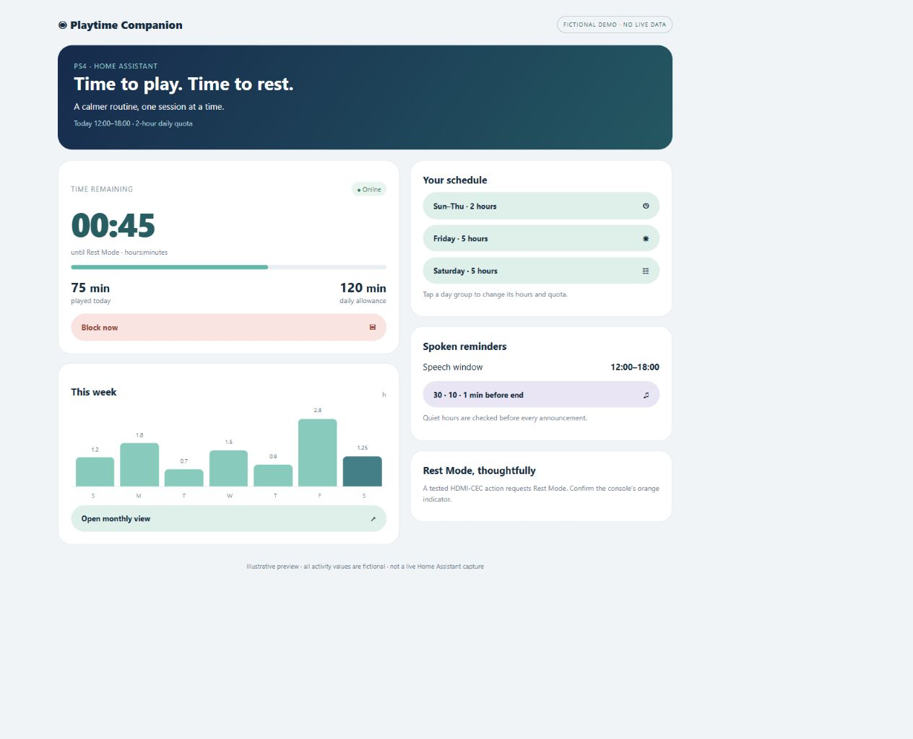
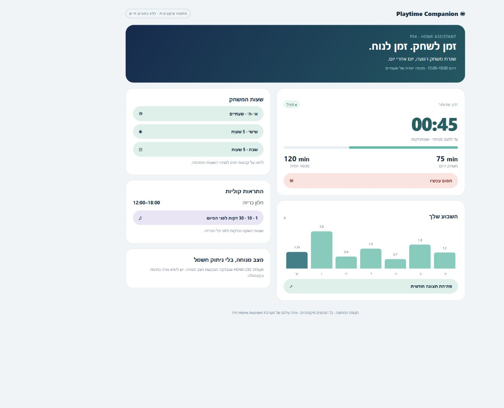

# PS4 Playtime Companion

**A Home Assistant playtime dashboard, daily schedules, quotas and quiet-hour-aware reminders.**

**Release v0.6.1 · PS4 · Home Assistant Core 2026.9.4 validated**

[Compatibility & prerequisites](docs/COMPATIBILITY.md) · [Architecture & flowchart](docs/ARCHITECTURE.md) · [Release notes](docs/RELEASE-v0.6.1.md)



<details><summary>Hebrew RTL fictional demo</summary>



</details>

*Screenshots show an isolated illustrative demo with fictional values, not household data or a live HA session. The reproducible demo source is in `docs/demo/`.*

[מדריך מלא בעברית](docs/INSTALL.he.md) · [Git & publishing](docs/GITHUB.md) · [Validation](docs/TESTING.md)

## Install by capability

Choose a capability below. **Install the [prerequisites](docs/COMPATIBILITY.md) and [helpers package](docs/INSTALL.he.md#2-helpers-וחיישן-זמן) first.** Import opens Home Assistant's Blueprint dialog; it does not create or enable an automation by itself. My Home Assistant asks for your own HA address when needed; no household address is embedded here.

### Schedule and daily quota enforcement

[](https://my.home-assistant.io/redirect/blueprint_import/?blueprint_url=https%3A%2F%2Fgithub.com%2FNirBY%2Fha-ps-playtime-companion%2Fblob%2Fmain%2Fblueprints%2Fautomation%2Fps4_playtime%2Fenforce.yaml)

**Example:** A fictional weekday allows 12:00–18:00 and 2 hours. A session starting at 17:00 ends at 18:00 even if daily time remains. If the console comes online outside the window, enforcement requests Rest Mode.

### Spoken reminders and quiet hours

[](https://my.home-assistant.io/redirect/blueprint_import/?blueprint_url=https%3A%2F%2Fgithub.com%2FNirBY%2Fha-ps-playtime-companion%2Fblob%2Fmain%2Fblueprints%2Fautomation%2Fps4_playtime%2Freminders.yaml)

**Example:** With a planned end at 17:00, reminders fall at 16:30, 16:50 and 16:59. With speech allowed 12:00–18:00, a reminder at 19:30 is skipped. Choose your own speaker and TTS provider; pass `{{ message }}` to the announcement action.

### CEC Rest Mode adapter

[](https://my.home-assistant.io/redirect/blueprint_import/?blueprint_url=https%3A%2F%2Fgithub.com%2FNirBY%2Fha-ps-playtime-companion%2Fblob%2Fmain%2Fblueprints%2Fscript%2Fps4_playtime%2Fcec_rest.yaml)

**Example:** The script sends turn_off to the selected TV and waits for the console availability sensor to go offline. Confirm a steady orange console LED, then wake with the PS4 controller and verify GoldHEN. Behaviour depends on HDMI-CEC hardware; this is not a standby.bin payload.

### Dashboard and supporting features

[](docs/CAPABILITIES.md#bubble-dashboard)
[](docs/CAPABILITIES.md#helpers-and-controls)

| Capability | Fictional example | Setup and example |
|---|---|---|
| Bubble dashboard + automatic language | Hebrew profile → RTL; English/other profile → English LTR | [Dashboard](docs/CAPABILITIES.md#bubble-dashboard) |
| Weekly / monthly chart | 1 h Monday, 1.5 h Tuesday; open the 30-day view | [Charts](docs/CAPABILITIES.md#weekly-and-monthly-charts) |
| Extra time + countdown | 2 h quota exhausted at 16:00; +15 gives a 00:15 allowance within the window | [Extra time](docs/CAPABILITIES.md#extra-time-and-countdown) |
| Manual block / release | Block an otherwise allowed session; release still respects schedule and quota | [Block](docs/CAPABILITIES.md#manual-block-and-release) |
| Editable daily schedules | Friday from 08:00, 5 h quota, no closing time | [Settings](docs/CAPABILITIES.md#editable-schedules) |

**Dashboard/package installation is manual:** Home Assistant's Blueprint importer supports automations and scripts, not dashboard YAML or packages. The installation buttons above lead to the appropriate steps.

## What you get

- Automatic per-user Hebrew RTL / English LTR Bubble dashboard (English fallback), daily summary and editable settings in pop-ups.
- +15 / +30 minute daily bonus buttons and an HH:MM countdown. Bonus expires at local midnight and never extends the closing time.
- Seven-day and thirty-day daily activity charts using Home Assistant long-term statistics.
- Separate weekday, Friday and Saturday windows and quotas; optional Friday closing time.
- Automation Blueprints for enforcement and spoken reminders.
- A script Blueprint for a **hardware-dependent CEC Rest Mode adapter**.
- A helpers/history sensor package, examples and an entity-mapping dashboard renderer.

This is a configuration project, not a custom integration or a HACS repository. Home Assistant Blueprints support automations and scripts, **not dashboards**. `dashboard/bubble.yaml` is the reusable dashboard template; the renderer is its configuration interface.

## Defaults

| Days | Allowed hours | Daily quota |
|---|---|---|
| Sunday–Thursday | 12:00–18:00 | 2 hours |
| Friday | From 08:00, no closing time | 5 hours |
| Saturday | 08:00–20:00 | 5 hours |

Spoken reminders default to 30, 10 and 1 minutes before the earlier of quota expiry or closing time. Speech is allowed only from **12:00 inclusive to 18:00 exclusive**, every day. All times use HA's configured local time zone. Friday's no-closing-time rule ends at midnight when Saturday's schedule takes over.

## Requirements

- Home Assistant Core **2026.9.4 validated**; 2024.10 is a syntax floor, not a tested compatibility promise. See the compatibility matrix.
- Bubble Card **3.2+** (standalone pop-ups), card-mod and config-template-card, installed through HACS.
- A reliable sensor reporting `online` / `offline` for the console. GoldHEN FTP availability is one possible source.
- A daily hours sensor with long-term statistics; the supplied history_stats sensor provides this.
- A Rest Mode action tested on your own hardware, and optionally a TTS provider and speaker.

## Quick installation

1. Back up your HA configuration. Install the three frontend dependencies.
2. Copy `packages/ps4_playtime.yaml` into `/config/packages/`. Replace `sensor.ps4_ftp_status` with your availability sensor. Enable packages as described in the Hebrew guide. **Existing installations: do not duplicate helpers or the daily sensor.**
3. Check configuration, restart HA once and run `script.ps4_initialize_defaults` **once** before enabling enforcement. Helpers have no `initial` override so later edits survive restarts. Re-running this script resets settings.
4. Copy `blueprints/automation/ps4_playtime/` and `blueprints/script/ps4_playtime/` to the corresponding `/config/blueprints/` directories. Create automations/scripts from Settings → Automations & scenes → Blueprints.
5. Select the availability sensor, helpers and a **tested** Rest Mode action. Configure reminders separately with your speaker/TTS action using `{{ message }}`. Example YAML is in `examples/`.
6. Render the dashboard with your entity names, then paste the output in the raw editor of a new dashboard whose URL path is `ps4-settings`:

   ```sh
   python -m pip install -r requirements-dev.txt
   python tools/render_dashboard.py --mapping dashboard/entities.example.yaml --output dashboard/rendered.yaml
   ```

7. Verify the settings, quiet-hour boundaries and physical console LED. Enable the enforcement automation only after the Rest Mode path is confirmed. The YAML examples deliberately start disabled; remove `initial_state: false` after commissioning if you want restored enabled state across restarts.

## Measurement and power behaviour

“Playtime” here means **time the availability sensor reports online**, including the home screen. Lost Wi-Fi or a disabled FTP server stops counting. This is not a tamper-proof parental-control system. The daily sensor resets at local midnight. Charts plot **daily change of the cumulative statistics sum**, not the sum of repeated daily readings. The first statistics day can be partial, and missing days are not zero-play days. Charts can lag the current sensor as statistics are compiled.

CEC was observed to put a PS4 into Rest Mode with GoldHEN still available after wake on the tested setup. This is not guaranteed on other firmware/HDMI combinations. Some TVs can enter Art Mode rather than become fully black. Other HDMI devices can wake the TV. The adapter neither wakes nor shuts down a set-top box and never cuts console power. FTP offline alone does not prove Rest Mode: confirm the steady orange LED. **No working `standby.bin` payload is bundled or claimed.**

Invalid same-day windows (end at/before start) suspend enforcement for that profile and show a dashboard warning; invalid speech windows suppress speech. Overnight windows are not supported. A late-starting session may miss an already-crossed reminder threshold. Custom announcement actions must not delay playback beyond the quiet window; a delayed script must check quiet hours again at actual playback.

## Repository layout

```text
blueprints/automation/ps4_playtime/  enforcement and reminders
blueprints/script/ps4_playtime/      optional CEC adapter
dashboard/                         reusable Bubble dashboard + entity mapping
packages/                          helpers, daily sensor, one-time defaults script
examples/                          disabled automation and script examples
tools/                             dashboard renderer
tests/                             portable configuration checks
docs/                              installation, Git and validation guides
```

## References

- [Bubble Card](https://github.com/Clooos/Bubble-Card)
- [card-mod](https://github.com/thomasloven/lovelace-card-mod)
- [Home Assistant Blueprint schema](https://www.home-assistant.io/docs/blueprint/schema/)
- [History Stats](https://www.home-assistant.io/integrations/history_stats/)
- [Statistics graph](https://www.home-assistant.io/dashboards/statistics-graph/)
- [Optional GoldHEN integration](https://github.com/Tech-Morph/HA-PS4-GoldHEN-Integration)

Original configuration files in this repository are MIT licensed. Third-party projects retain their own licenses. This project is not affiliated with Sony, GoldHEN, Bubble Card or Home Assistant.

## Automatic language and bonus-button visibility

The dashboard reads the viewing user’s Home Assistant frontend language. Hebrew (`he`/`iw`, including regional variants) uses RTL; all other or missing language values use English LTR. There is no language toggle. Reload the dashboard after changing the HA profile language. This is frontend localization; automation Blueprint metadata stays in English and the configured speech language is unchanged.

Extra-time buttons are shown only when outside the allowed window or when the daily quota, including today’s bonus, has been exhausted. The `binary_sensor.ps4_extra_time_available` template helper evaluates the same rules as enforcement and updates on time/helper changes. Buttons stay hidden for invalid schedules. Bonus still does not extend closing time.

## Manual block

Block now is available only when the schedule/quota restriction is off and no manual block exists. It enables the enforcement automation and sets `input_boolean.ps4_manual_block`. A currently online console receives the tested Rest Mode action; later online detection is also enforced. The lock persists across midnight and restarts until explicitly released. Release manual block does not wake the console or override schedule/quota restrictions. Speech reminders are suppressed while manually blocked. If you rename the enforcement automation, update its target in `script.ps4_block_playtime` as well as the dashboard mapping.

## Import help

Use the blue Import buttons above, then select **Preview → Import blueprint → Create automation/script** and map your entities. [Capability examples and installation details](docs/CAPABILITIES.md) cover every feature.

If My Home Assistant does not open your instance, copy the relevant YAML GitHub link from the capability guide into Settings → Automations & scenes → Blueprints → Import Blueprint.
