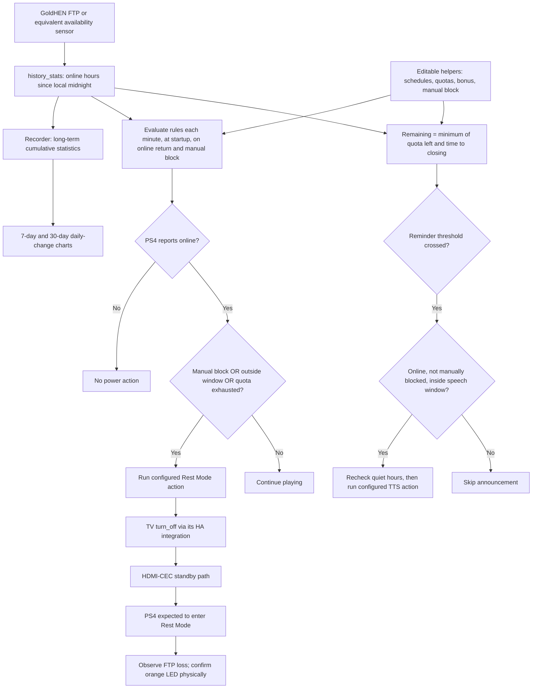

# How it is built

This is a **Home Assistant YAML configuration bundle**, not a binary payload, custom integration or remote console service. Its files were assembled from a working HA configuration, parameterized with Blueprint `!input` selectors, and checked with Python/PyYAML plus HA's template and configuration-validation APIs. Public examples use generic entity IDs. It contains no home addresses, credentials, household history or device identifiers.

## Technology choices

- **YAML automation/script Blueprints** expose entity selectors and user-supplied actions, keeping hardware-specific power behaviour separate from schedule logic.
- **Jinja templates** select today's profile, combine the base quota with a date-scoped bonus, enforce quiet hours, and calculate the remaining time.
- **Persistent HA helpers** hold editable times, quotas, bonus date/minutes and manual-block state. They have no `initial` overrides, so edited settings survive HA restarts.
- **history_stats + recorder long-term statistics** measure online hours and retain usage history. Native statistics cards plot daily `change` in cumulative `sum`, not a sum of repeatedly sampled daily readings.
- **Bubble Card 3.2+** supplies buttons and standalone pop-ups. **card-mod** styles cards; **config-template-card** reads the viewing user's frontend language (`he`/`iw` → Hebrew RTL, otherwise English LTR).
- **HDMI-CEC through the TV** is the selected Rest Mode adapter. The HA action asks the TV to turn off; the physically tested HDMI chain is expected to pass standby to PS4. It is replaceable with another independently verified Rest Mode action.
- **TTS** is optional and provider-specific. The reminder Blueprint supplies `message` and `minutes`; the installer chooses the provider, language and speaker action.
- **Python + PyYAML** render entity mappings and run repository checks. GitHub Actions runs the portable test suite. There is no Python process required on the console.

## Runtime flow

## Rules and controls

Opening time is inclusive; closing time is exclusive. Friday can omit closing time, but its rule ends at local midnight. Daily quota resets then. Bonus minutes are valid only when the stored bonus date equals today's local date; this works even if HA was offline at midnight. A manual block persists until explicitly released, including across midnight.

Extra-time controls appear only when outside the play window or quota is exhausted. They **add quota only** and do not extend the closing time. Block now appears only when no schedule/quota restriction or manual block exists. It enables enforcement and sets the manual-block helper. Release clears only the manual lock and never wakes the console or overrides time restrictions.

The countdown shows HH:MM with roughly minute resolution. It is not an exact second-level shutdown timer or a confirmation of hardware state. FTP online includes the home screen; disabled FTP or network loss stops counting. This is a household routine aid, not tamper-proof access control.

## What was tested

HA 2026.9.4 accepted the expanded Blueprint triggers/conditions/actions. HA template rendering covered 210 schedule/quota cases, quiet-hour boundaries, seven bonus scenarios and fourteen manual-block combinations. Browser checks covered the real dashboard's layout, automatic English selection and conditional controls. These checks do not establish universal firmware/CEC compatibility or replace commissioning on the target hardware.

The public screenshots are captures of the isolated HTML illustration in `docs/demo/`, rendered with fictional values. They illustrate the design and intended states; they are **not** screenshots of a live household or a pixel-exact guarantee of every HA theme. No real usage history was loaded into the demo.
